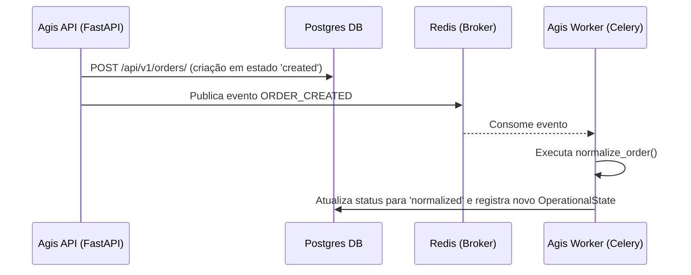

# 📖 Manual Técnico de API e Fluxo de Integração - Agis v3.0

Este guia descreve os endpoints da API REST, as credenciais e o ciclo de vida operacional assíncrono (Celery/Redis) de mensageria implementados na versão **3.0.0-alpha** do **Agis**.

---

## 1. Autenticação JWT

Todas as requisições para endpoints protegidos devem incluir o token no cabeçalho HTTP:
`Authorization: Bearer <seu_token_jwt>`

### Login (`POST /api/v1/auth/login`)
Gera um token de acesso válido.

* **Payload:**
```json
{
  "username": "admin",
  "password": "admin123"
}
```
* **Resposta (200 OK):**
```json
{
  "access_token": "eyJhbGciOi...",
  "token_type": "bearer"
}
```

---

## 2. Ciclo de Vida do Pedido (Endpoints de Negócio)



### 2.1 Criar Pedido (`POST /api/v1/orders/`)
Inicializa um pedido no sistema. O status inicial padrão é `created`.

* **Payload:**
```json
{
  "origin_platform": "shoppi",
  "origin_order_id": "SH-99238",
  "address_street": "Avenida Getúlio Vargas",
  "address_number": "1200-N",
  "address_city": "Chapecó",
  "address_state": "SC",
  "address_zipcode": "89801-000",
  "weight_kg": 2.5,
  "declared_value_brl": 150.00
}
```

### 2.2 Listar Pedidos (`GET /api/v1/orders/`)
Retorna todos os pedidos cadastrados, com paginação e filtros opcionais por status.

---

## 3. Gestão Operacional de Motoristas

### 3.1 Atualizar Geolocalização (`PATCH /api/v1/drivers/{id}/location`)
Atualiza a posição física do motorista e recalcula a confiança do seu estado de disponibilidade geográfica.

* **Payload:**
```json
{
  "current_latitude": -27.1002,
  "current_longitude": -52.6152
}
```

### 3.2 Atualizar Status Operacional (`PATCH /api/v1/drivers/{id}/status`)
Modifica a disponibilidade (`available`, `on_route`, `on_break`, `offline`).

---

## 4. Otimização e Geração de Rotas (`POST /api/v1/routes/`)
Agrupa os pedidos normalizados do mesmo depósito regional e atribui a um motorista otimizando a rota física mais curta. Executa de forma assíncrona no Celery Worker.
