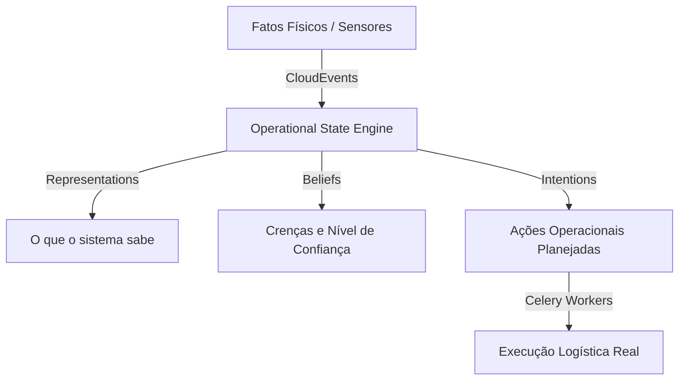

# 🧠 Arquitetura Cognitiva e Operacional (OCC Concept) - Agis v3.0

Este documento descreve a fundamentação teórica e a arquitetura técnica por trás do **Operational State Engine** do **Agis v3.0**, inspirado no modelo conceitual do **GuardDrive / Sovereign Cortex** para a orquestração de estados cognitivos.

---

## 1. Visão Geral do Conceito

Diferente de sistemas de logística tradicionais que controlam a entrega através de *flags* ou tabelas estáticas de status (ex: `PENDENTE`, `EM_TRANSITO`, `ENTREGUE`), o **Agis v3.0** gerencia as entidades operacionais (Pedidos, Motoristas, Rotas) como **agentes com estados cognitivos fluidos**, baseando-se no modelo **OCC (Ortony, Clore, Collins)** de representação cognitiva adaptado à infraestrutura física.



---

## 2. A Estrutura do Estado Operacional (`operational_states`)

Cada transição de estado no sistema é imutável e gera um registro histórico na tabela `operational_states`. O estado possui cinco dimensões cognitivas principais representadas em formato JSON:

| Dimensão | Descrição | Exemplo Prático (Order / Pedido) |
| :--- | :--- | :--- |
| **Representations** | O modelo de dados bruto que o sistema conhece sobre a entidade naquele instante. | Coordenadas de GPS, endereço limpo, peso da carga. |
| **Knowledge** | Relações estruturadas, regras de negócio inferidas e padrões históricos. | "Este cliente costuma preferir entregas no período da manhã." |
| **Beliefs** | Suposições e crenças do sistema sobre a integridade ou o andamento físico da operação. | "Acreditamos que o motorista está parado no trânsito pois a velocidade é 0 km/h." |
| **Decisions** | Ações e tomadas de decisão deliberadas pelo motorista ou algoritmo de roteamento. | "Atribuir o motorista X à rota Y devido à proximidade geográfica." |
| **Intentions** | Intenções de ações futuras agendadas ou planejadas. | "Disparar SMS de alerta ao cliente quando o veículo estiver a 2km." |

---

## 3. Dinâmica do Motor de Estado

### 3.1 Decaimento de Confiança (`Confidence Decay`)
A validade das informações no mundo real decai com o tempo. Uma coordenada de GPS recebida há 1 minuto tem confiança $1.0$, mas após 15 minutos sem novos sinais físicos, a confiança do sistema decai gradualmente. O motor de estado calcula a expiração do estado atual por meio do campo `valid_until`.

### 3.2 Otimização de Rotas (`routing/optimizer.py`)
Com base nas crenças sobre o tráfego e conhecimento histórico de entregas falhas por motorista/região, o motor executa tarefas de otimização em segundo plano (via Celery) recalculando as melhores rotas físicas através do algoritmo *Nearest Neighbor*.

---

## 4. O Fluxo de Eventos Físicos (PoPE - Proof of Physical Event)

O sistema de eventos (`src/operational_state/events.py`) é compatível com a especificação **CloudEvents (v1.0)**, garantindo portabilidade para auditoria forense.

```
┌─────────────────┐       ┌──────────────────────────┐       ┌─────────────────┐
│ Evento Físico   ├──────>│   Operational Event      ├──────>│   State Engine  │
│ (ex: GPS, NFC)  │       │ (operational_events log) │       │ (Calcula OCC)   │
└─────────────────┘       └──────────────────────────┘       └─────────────────┘
```

1. **Ingestão**: Pedidos ou eventos de telemetria entram via conectores API.
2. **Normalização**: O evento é catalogado e inserido na tabela `operational_events`.
3. **Processamento Assíncrono**: O Celery despacha o evento, aciona o `OperationalStateEngine` correspondente, transiciona o estado da entidade, atualizando a confiança e gerando novas **Intentions** (ex: notificar cliente).
