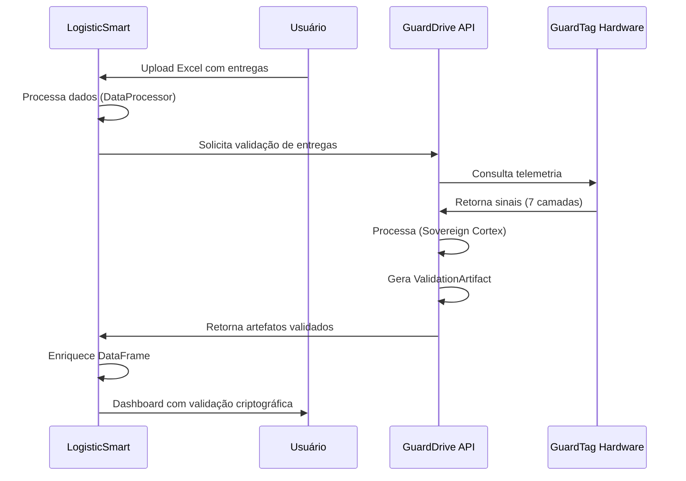

# 🔧 LogisticSmart como Produto Independente: Consumo Opcional de APIs Externas

**Abordagem Arquitetural:** O LogisticSmart mantém independência funcional absoluta e identidade técnica própria. Ele é capaz de rodar 100% de forma isolada, podendo opcionalmente se integrar a serviços externos como o GuardDrive exclusivamente via chamadas de API desacopladas.

**Data:** 2026-07-09  
**Status:** Análise de Arquitetura Desacoplada e Autônoma

---

## 🎯 Conceito: Infrastructure as a Service (IaaS)

### **Modelo Proposto**
```
┌─────────────────────────────────────────────────────────────┐
│                    LogisticSmart (Produto)                    │
│  - Interface Streamlit                                        │
│  - Autenticação própria                                       │
│  - Dashboards e Relatórios                                   │
│  - Base de usuários logísticos                               │
└──────────────────────┬──────────────────────────────────────┘
                       │ API REST/WebSocket
                       │
┌──────────────────────▼──────────────────────────────────────┐
│              GuardDrive Infrastructure (Serviço)              │
│  - Edge Layer (GuardTag)                                     │
│  - Processing Layer (Sovereign Cortex)                        │
│  - Forensic Layer (Magistrado Themis)                        │
│  - Signature Layer (UEAP)                                     │
│  - Database (ValidationArtifacts)                            │
└─────────────────────────────────────────────────────────────┘
```

### **Benefícios desta Abordagem**
- **LogisticSmart** mantém roadmap e identidade independentes
- **GuardDrive** pode servir múltiplos clientes (não só LogisticSmart)
- **Acoplamento fraco** - LogisticSmart funciona sem GuardDrive
- **Escalabilidade** - Infraestrutura compartilhada reduz custos
- **Flexibilidade** - Integração opcional e gradual

---

## 🏗️ Componentes de Infraestrutura Reutilizáveis

### **1. Edge Layer (GuardTag Hardware)**

#### **O que GuardDrive oferece**
- Captura de eventos físicos via 7 camadas de sensores
- Telemetria em tempo real (GPS, BLE, IR, OBD-II)
- Identificação criptográfica (NFC, TOTP visual)

#### **Como LogisticSmart consome**
```python
# LogisticSmart integra com GuardTag via API
class GuardTagIntegration:
    def get_device_telemetry(self, device_id: str, time_range: tuple):
        """Consome telemetria do GuardTag via API GuardDrive"""
        response = requests.get(
            f"{GUARDDRIVE_API}/devices/{device_id}/telemetry",
            params={"start": time_range[0], "end": time_range[1]},
            headers={"Authorization": f"Bearer {self.api_key}"}
        )
        return response.json()
    
    def validate_delivery_event(self, device_id: str, delivery_id: str):
        """Valida se entrega física ocorreu via GuardTag"""
        response = requests.post(
            f"{GUARDDRIVE_API}/events/validate",
            json={"device_id": device_id, "delivery_id": delivery_id},
            headers={"Authorization": f"Bearer {self.api_key}"}
        )
        return response.json()["validated"]
```

#### **Benefícios para LogisticSmart**
- Dados de localização e status **automaticamente capturados**
- Eliminação de entrada manual de dados
- Validação física de entregas

---

### **2. Processing Layer (Sovereign Cortex)**

#### **O que GuardDrive oferece**
- Processamento de sinais multimodais (7 camadas)
- Inferência em borda via YOLOv11 OBB
- Validação PoPE (Proof of Physical Event)

#### **Como LogisticSmart consome**
```python
# LogisticSmart envia dados para processamento
class SovereignCortexClient:
    def process_delivery_signals(self, raw_signals: dict):
        """Envia sinais brutos para processamento GuardDrive"""
        response = requests.post(
            f"{GUARDDRIVE_API}/cortex/process",
            json={"signals": raw_signals},
            headers={"Authorization": f"Bearer {self.api_key}"}
        )
        return response.json()  # Retorna PoPE consensus hash
```

#### **Benefícios para LogisticSmart**
- Processamento avançado de sinais sem implementar IA
- Validação consensual de eventos físicos
- Redução de complexidade técnica

---

### **3. Forensic Layer (Magistrado Themis)**

#### **O que GuardDrive oferece**
- Geração autônoma de laudos periciais
- LLM com arquitetura RAG ancorada em frameworks legais
- Análise de anomalias e padrões suspeitos

#### **Como LogisticSmart consome**
```python
# LogisticSmart solicita laudos periciais
class MagistradoThemisClient:
    def generate_forensic_report(self, event_id: str):
        """Solicita laudo pericial para evento específico"""
        response = requests.post(
            f"{GUARDDRIVE_API}/themis/report",
            json={"event_id": event_id},
            headers={"Authorization": f"Bearer {self.api_key}"}
        )
        return response.json()["report"]  # Laudo em formato estruturado
```

#### **Benefícios para LogisticSmart**
- Laudos periciais automáticos para disputas
- Análise de anomalias sem expertise interna
- Diferencial competitivo em auditoria

---

### **4. Signature Layer (UEAP)**

#### **O que GuardDrive oferece**
- Geração de ValidationArtifacts assinados criptograficamente
- Assinatura Ed25519 para integridade
- Hash SHA-256 consolidado dos sinais

#### **Como LogisticSmart consome**
```python
# LogisticSmart valida assinaturas de eventos
class UEAPValidator:
    def verify_event_signature(self, artifact: dict):
        """Verifica assinatura criptográfica de evento"""
        response = requests.post(
            f"{GUARDDRIVE_API}/ueap/verify",
            json={"artifact": artifact},
            headers={"Authorization": f"Bearer {self.api_key}"}
        )
        return response.json()["valid"]
```

#### **Benefícios para LogisticSmart**
- Validação criptográfica de eventos
- Imutabilidade de dados processados
- Compliance com regulamentações

---

### **5. Database Layer (ValidationArtifacts)**

#### **O que GuardDrive oferece**
- Schema PoPE-Ready (Devices, ValidationArtifacts)
- Time-series database para telemetria
- Segregação LGPD-compliant

#### **Como LogisticSmart consome**
```python
# LogisticSmart consulta artefatos de validação
class ValidationArtifactsDB:
    def query_delivery_artifacts(self, delivery_id: str):
        """Consulta todos os artefatos de uma entrega"""
        response = requests.get(
            f"{GUARDDRIVE_API}/artifacts/delivery/{delivery_id}",
            headers={"Authorization": f"Bearer {self.api_key}"}
        )
        return response.json()  # Lista de ValidationArtifacts
```

#### **Benefícios para LogisticSmart**
- Armazenamento especializado sem implementar schema
- Consultas otimizadas para artefatos de evidência
- Compliance LGPD nativo

---

## 📊 Arquitetura de Integração

### **Camada de API (GuardDrive como Backend Service)**

```python
# LogisticSmart: Configuração de integração
# src/config/guarddrive_config.py

GUARDDRIVE_CONFIG = {
    "api_endpoint": "https://api.guarddrive.io/v1",
    "api_key": os.getenv("GUARDDRIVE_API_KEY"),
    "timeout": 30,
    "retry_policy": {
        "max_retries": 3,
        "backoff_factor": 2
    }
}

# LogisticSmart: Cliente unificado
# src/integrations/guarddrive_client.py

class GuardDriveClient:
    """Cliente unificado para serviços GuardDrive"""
    
    def __init__(self):
        self.config = GUARDDRIVE_CONFIG
        self.api_key = self.config["api_key"]
        self.base_url = self.config["api_endpoint"]
    
    def get_telemetry(self, device_id: str, start: datetime, end: datetime):
        """Obtém telemetria de dispositivo"""
        pass
    
    def validate_event(self, event_data: dict):
        """Valida evento físico"""
        pass
    
    def generate_forensic_report(self, event_id: str):
        """Gera laudo pericial"""
        pass
    
    def verify_signature(self, artifact: dict):
        """Verifica assinatura criptográfica"""
        pass
```

### **Data Processor Estendido**

```python
# LogisticSmart: Extensão do DataProcessor
# src/utils/data_processor.py

class DataProcessor:
    def __init__(self):
        self.df = None
        self.detected_columns = {}
        self.guarddrive_client = GuardDriveClient()  # Nova integração
    
    def enrich_with_guardtag_data(self, delivery_id: str):
        """Enriquece dados do DataFrame com telemetria GuardTag"""
        if not self.guarddrive_client.api_key:
            logger.warning("GuardDrive API key não configurada")
            return
        
        # Para cada entrega, buscar telemetria correspondente
        for idx, row in self.df.iterrows():
            device_id = row.get('device_id') or row.get('veiculo_id')
            if device_id:
                telemetry = self.guarddrive_client.get_telemetry(
                    device_id=device_id,
                    start=row['data_entrega'] - timedelta(hours=1),
                    end=row['data_entrega'] + timedelta(hours=1)
                )
                
                # Enriquecer DataFrame
                self.df.at[idx, 'localizacao_real'] = telemetry.get('location')
                self.df.at[idx, 'status_validado'] = telemetry.get('validated')
                self.df.at[idx, 'hash_atestacao'] = telemetry.get('artifact_hash')
```

---

## 🔄 Fluxo de Dados Integrado

### **Cenário: Entrega com Validação GuardDrive**



---

## 🎨 Interface LogisticSmart com Dados GuardDrive

### **Dashboard Enriquecido**

```python
# LogisticSmart: Dashboard com validação GuardDrive
def render_dashboard_tab():
    """Renderiza dashboard com dados GuardDrive"""
    
    # Métricas tradicionais
    st.metric("📦 Total de Entregas", len(df))
    st.metric("👥 Entregadores", df['entregador'].nunique())
    
    # Novas métricas GuardDrive
    if 'status_validado' in df.columns:
        validated_count = df[df['status_validado'] == True].shape[0]
        st.metric("✅ Entregas Validadas", validated_count)
        
        validation_rate = (validated_count / len(df)) * 100
        st.metric("📊 Taxa de Validação", f"{validation_rate:.1f}%")
    
    # Gráfico de localização real vs declarada
    if 'localizacao_real' in df.columns:
        fig = px.scatter_mapbox(
            df,
            lat='latitude_real',
            lon='longitude_real',
            color='status_validado',
            mapbox_style="open-street-map"
        )
        st.plotly_chart(fig)
```

---

## 🔐 Segurança e Autenticação

### **Modelo de Autenticação Híbrido**

```python
# LogisticSmart mantém autenticação própria
# GuardDrive usa API keys para serviço

class HybridAuth:
    """Autenticação híbrida: LogisticSmart + GuardDrive"""
    
    def authenticate_user(self, username: str, password: str):
        """Autenticação LogisticSmart (existente)"""
        return self.auth_manager.authenticate(username, password)
    
    def authenticate_service(self):
        """Autenticação serviço GuardDrive (API key)"""
        if not os.getenv("GUARDDRIVE_API_KEY"):
            logger.warning("GuardDrive não configurado - modo offline")
            return None
        return GuardDriveClient()
```

### **Segurança de Dados**
- LogisticSmart: Dados de negócio (clientes, contratos)
- GuardDrive: Dados de infraestrutura (telemetria, artefatos)
- Separação clara de responsabilidades

---

## 💰 Modelo de Negócio

### **LogisticSmart**
- Vende licenças de software para análise logística
- Oferece módulo premium "GuardDrive-Enabled"
- Cliente paga LogisticSmart + opcionalmente GuardDrive

### **GuardDrive**
- Vende infraestrutura como serviço (API)
- Cobra por volume de chamadas/telemetria
- LogisticSmart é um de seus clientes

### **Cliente Final**
- Compra LogisticSmart para análise
- Opcionalmente compra GuardDrive para validação física
- Pode usar LogisticSmart sem GuardDrive (modo offline)

---

## 📋 Roadmap de Implementação

### **Fase 1: API Client (2-3 semanas)**
- [ ] Implementar `GuardDriveClient` básico
- [ ] Configuração de API key
- [ ] Testes de integração com sandbox GuardDrive
- [ ] Documentação de endpoints

### **Fase 2: Enriquecimento de Dados (3-4 semanas)**
- [ ] Extensão de `DataProcessor` para consumir API
- [ ] Enriquecimento automático de DataFrame
- [ ] Dashboard com métricas GuardDrive
- [ ] Modo offline gracefully degrade

### **Fase 3: Recursos Avançados (1-2 meses)**
- [ ] Geração de laudos periciais (Magistrado Themis)
- [ ] Validação criptográfica de eventos
- [ ] Mapas de localização real
- [ ] Alertas de anomalias

### **Fase 4: Produção (2-3 meses)**
- [ ] Monitoramento de performance API
- [ ] Cache de respostas para reduzir latência
- [ ] Rate limiting e retry policies
- [ ] Logging de integração

---

## 🎯 Comparação: Abordagens

| Aspecto | Transformação em Produto GuardDrive | Reuso de Infraestrutura |
|---------|-----------------------------------|-------------------------|
| **Identidade LogisticSmart** | Perdida | Mantida |
| **Acoplamento** | Alto | Baixo |
| **Flexibilidade** | Baixa | Alta |
| **Time-to-market** | Longo | Curto |
| **Risco técnico** | Alto | Baixo |
| **Escalabilidade** | Limitada | Alta |
| **Modelo de negócio** | Monolítico | Modular |

---

## 🏁 Conclusão

**Esta abordagem é superior** para o seu caso porque:

1. **LogisticSmart mantém sua identidade** - Continua sendo um produto de análise logística
2. **GuardDrive serve múltiplos clientes** - Infraestrutura compartilhada reduz custos
3. **Integração opcional** - LogisticSmart funciona sem GuardDrive
4. **Menor risco técnico** - Acoplamento fraco permite iterar independentemente
5. **Modelo de negócio claro** - Cada produto tem seu valor e pricing

**Recomendação:** Implementar Fase 1 (API Client) para validar a integração técnica antes de investir em recursos avançados.

---

*Documento gerado por Cascade AI*  
*Arquitetura modular de reuso de infraestrutura*
