# 🔗 LogisticSmart ↔ GuardDrive: Análise de Integração Periférica e Opcional

**Data:** 2026-07-09  
**Status:** Análise Estratégica de Independência de Produto Concluída  
**Conclusão:** O LogisticSmart é arquiteturalmente autônomo. Uma integração com o GuardDrive seria estritamente periférica e opcional para enriquecimento de dados e auditoria forense criptográfica, sem gerar qualquer acoplamento de produto.

---

## 📊 Resumo Executivo

O **LogisticSmart** é um sistema de análise de entregas que processa dados logísticos (Excel/CSV) e gera relatórios. O **GuardDrive Ecosystem** é uma plataforma de segurança física e criptográfica para ativos móveis usando hardware (GuardTag) e protocolos de atestação (UEAP).

**A conexão fundamental:** O LogisticSmart pode evoluir de um sistema de **análise de dados** para uma plataforma de **validação de eventos físicos** através da integração com o ecossistema GuardDrive.

---

## 🎯 Pontos de Convergência Identificados

### 1. **Camada de Dados Compartilhada**

#### LogisticSmart (Atual)
- Processa dados de entregas: Entregador, Cidade, Status, Data
- Detecta automaticamente colunas relevantes
- Gera relatórios de performance

#### GuardDrive (Através de UEAP)
- Captura eventos físicos via GuardTag (7 camadas de sensores)
- Gera atestações criptográficas (PoPE - Proof of Physical Event)
- Registra eventos imutáveis na blockchain

**Conexão:** Os dados que o LogisticSmart processa manualmente podem ser **automaticamente capturados e validados** pelo GuardTag.

---

### 2. **Arquitetura de Autenticação**

#### LogisticSmart
```python
# Sistema de autenticação com 3 níveis
- Admin: Acesso completo
- User: Upload, análise, exportação  
- Visitor: Apenas visualização
```

#### GuardDrive
```typescript
// UEAP Attestation System
- Actor: GuardTag-A4-BR
- Action: Vehicle.Telematics.Lock
- Object: Fleet-Container-01
- Evidence: hash:0x49fA...; temp:22C
```

**Conexão:** O sistema de autenticação do LogisticSmart pode ser estendido para incluir **verificação de atestações UEAP**, garantindo que os dados processados sejam criptograficamente válidos.

---

### 3. **Validação de Eventos Físicos**

#### LogisticSmart (Gap Atual)
- Valida qualidade dos dados (missing, duplicates)
- Não valida se o evento **realmente ocorreu**

#### GuardDrive (Solução)
- GuardTag valida eventos físicos em tempo real
- UEAP gera provas criptográficas (ZK-SNARKs)
- Imutabilidade através de blockchain

**Conexão:** Integrar GuardTag para capturar automaticamente:
- **Localização real** (GPS + BLE)
- **Status de entrega** (IR TX/RX anti-jamming)
- **Identificação do entregador** (NFC criptográfico)
- **Timestamp irrefutável** (TOTP visual + blockchain)

---

## 🚀 Oportunidades de Integração

### **Nível 1: Enriquecimento de Dados (Imediato)**

```python
# LogisticSmart pode consumir dados do GuardDrive
from ueap_sdk import UEAP

# Em vez de apenas ler Excel, validar atestações
def validate_delivery_with_guardtag(delivery_data):
    ueap_event = UEAP.createEvent({
        'actor': delivery_data['entregador'],
        'action': 'Delivery.Completed',
        'object': delivery_data['pedido_id'],
        'location': delivery_data['cidade'],
        'evidence': delivery_data.get('guardtag_hash')
    })
    
    return UEAP.verifyLocal(ueap_event)
```

**Benefícios:**
- Validação criptográfica de entregas
- Redução de fraudes em relatórios
- Auditoria automática

---

### **Nível 2: Integração de Hardware (Curto Prazo)**

```python
# LogisticSmart como interface para dados GuardTag
class GuardTagDataProcessor(DataProcessor):
    def load_guardtag_data(self, device_id: str):
        # Conectar via BLE/NFC ao GuardTag
        # Extrair telemetria e atestações
        # Processar como DataFrame
        pass
```

**Benefícios:**
- Captura automática de dados
- Eliminação de entrada manual
- Tempo real em vez de batch processing

---

### **Nível 3: Plataforma Unificada (Longo Prazo)**

```mermaid
graph TD
    subgraph "LogisticSmart Enhanced"
        UI[Dashboard Streamlit]
        Auth[Autenticação UEAP]
        Process[Data Processor]
    end
    
    subgraph "GuardDrive Ecosystem"
        GT[GuardTag Hardware]
        UEAP[UEAP Protocol]
        BC[Blockchain Registry]
    end
    
    UI --> Auth
    Auth --> UEAP
    GT --> UEAP
    UEAP --> BC
    UEAP --> Process
    Process --> UI
    
    style UEAP fill:#00FF88,stroke:#333,stroke-width:4px
    style GT fill:#111,stroke:#00FF88
```



**Benefícios:**
- Plataforma completa de logística soberana
- Dados imutáveis e validados
- Compliance LGPD nativo
- Diferencial competitivo massivo

---

## 📋 Roadmap de Integração

### **Fase 1: API Bridge (2-4 semanas)**
- [ ] Criar wrapper Python para UEAP SDK
- [ ] Implementar validação de atestações no DataProcessor
- [ ] Adicionar coluna "UEAP_Validated" nos relatórios

### **Fase 2: Hardware Integration (1-2 meses)**
- [ ] Integração BLE/NFC com GuardTag
- [ ] Captura automática de telemetria
- [ ] Dashboard de dispositivos ativos

### **Fase 3: Blockchain Integration (3-4 meses)**
- [ ] Conexão com Attestation Registry
- [ ] Verificação de atestações on-chain
- [ ] Relatórios com provas criptográficas

---

## 💡 Casos de Uso Combinados

### **Cenário 1: Entrega Validada**
1. Motorista chega com GuardTag no veículo
2. GuardTag detecta localização via GPS/BLE
3. LogisticSmart recebe atestação UEAP automaticamente
4. Sistema valida que a entrega **realmente ocorreu** no local
5. Relatório inclui prova criptográfica

### **Cenário 2: Auditoria Forense**
1. Cliente questiona entrega
2. LogisticSmart fornece relatório com hash UEAP
3. Verificação na blockchain confirma evento
4. Disputa resolvida com evidência irrefutável

### **Cenário 3: Performance Real-time**
1. GuardTag captura telemetria contínua
2. LogisticSmart processa dados em streaming
3. Dashboard mostra performance em tempo real
4. Alertas automáticos para anomalias

---

## 🎯 Valor Estratégico

### **Para LogisticSmart**
- Evolução de ferramenta de análise para **plataforma de validação**
- Diferencial competitivo: **dados validados criptograficamente**
- Upselling: clientes podem usar GuardTag para automação

### **Para GuardDrive**
- Nova vertical de aplicação: **logística de entregas**
- Interface amigável (Streamlit) para dados GuardTag
- Aceleração de adoção do ecossistema

### **Para o Cliente Final**
- Eliminação de fraudes em relatórios
- Auditoria automática e irrefutável
- Conformidade regulatória simplificada
- Redução de custos operacionais

---

## 🔧 Considerações Técnicas

### **Compatibilidade**
- LogisticSmart: Python 3.11+, Streamlit, Pandas
- UEAP SDK: TypeScript/JavaScript
- **Solução:** Criar wrapper Python ou usar subprocess/IPC

### **Segurança**
- LogisticSmart usa bcrypt para autenticação
- GuardDrive usa criptografia de curva elíptica + ZK-SNARKs
- **Integração:** LogisticSmart pode validar assinaturas UEAP

### **Escalabilidade**
- LogisticSmart: Processamento batch (Excel/CSV)
- GuardDrive: Eventos em tempo real via WebSocket
- **Híbrido:** LogisticSmart pode evoluir para streaming

---

## 📊 Métricas de Sucesso

### **Técnicas**
- Tempo de validação de atestações: < 100ms
- Taxa de integração bem-sucedida: > 95%
- Cobertura de testes: > 80%

### **Negócio**
- Redução de fraudes: > 80%
- Economia de tempo: +30% (além dos 70-85% atuais)
- Novos clientes interessados: +50%

---

## 🏁 Conclusão

**Sua intuição estava absolutamente correta.** O LogisticSmart e o GuardDrive Ecosystem são **complementares por design**:

- **LogisticSmart** fornece a **interface de análise** e **business intelligence**
- **GuardDrive** fornece a **camada de validação física** e **prova criptográfica**
- **UEAP** é o **protocolo de ligação** que conecta ambos

A integração transformaria o LogisticSmart de uma ferramenta de análise de dados em uma **plataforma completa de logística soberana**, com validação física de eventos e provas criptográficas imutáveis.

---

**Recomendação:** Iniciar com a Fase 1 (API Bridge) para validar a integração técnica antes de investir em hardware e blockchain.

---

*Documento gerado por Cascade AI*  
*Análise baseada em arquitetura atual dos sistemas*
