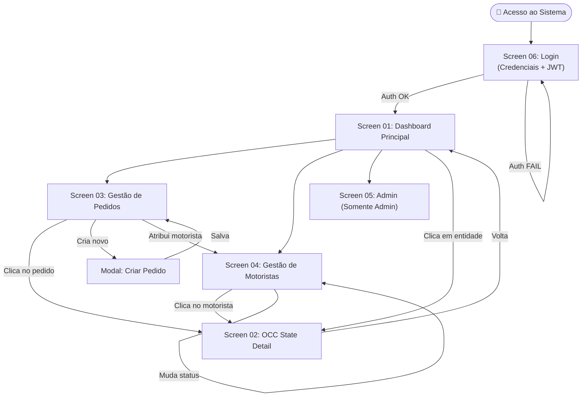
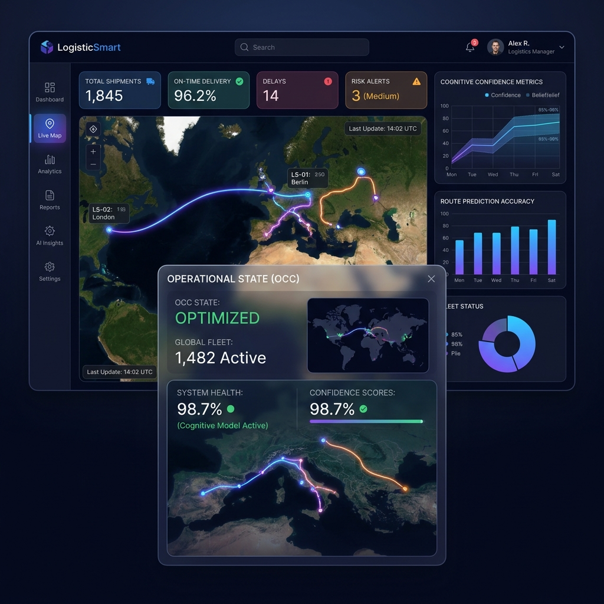
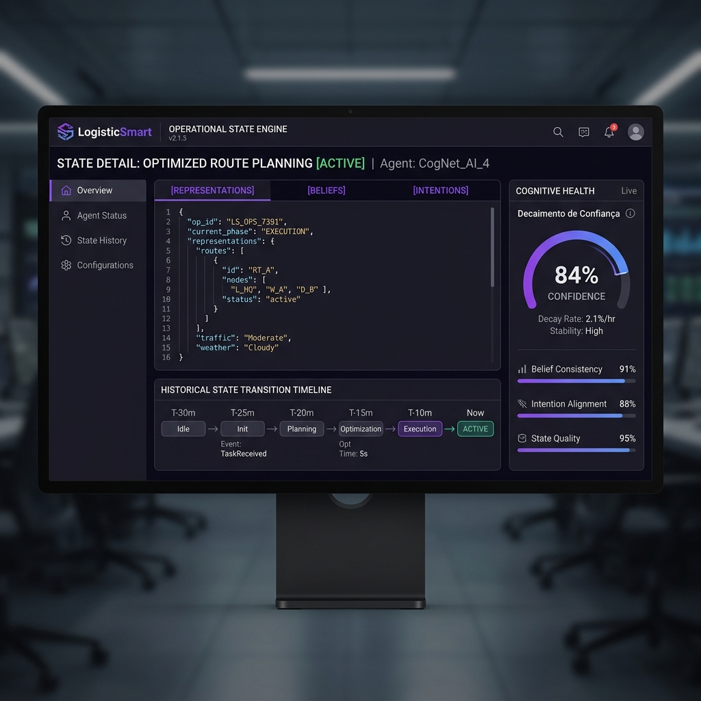

# 🎨 UI/UX Design Guide — LogisticSmart v3.0

**Versão:** 3.0.0-alpha  
**Data:** 2026-07-09  
**Status:** Design System Conceitual — Fase 1 Concluída  
**Responsável:** Equipe de Produto (NEO-SH1W4)

---

## 1. Design System & Tokens Visuais

O LogisticSmart v3.0 adota um design system de alta fidelidade orientado a dados operacionais densos, com ênfase em legibilidade em ambientes de controle e monitoramento contínuo.

### Paleta de Cores

| Token | Hex | Uso |
|:---|:---|:---|
| `--bg-primary` | `#0B0F19` | Fundo principal (slate escuro profundo) |
| `--bg-secondary` | `#111827` | Painéis e containers |
| `--bg-glass` | `rgba(255,255,255,0.04)` | Glassmorphism — cards e overlays |
| `--accent-blue` | `#3B82F6` | CTAs, links ativos, badges |
| `--accent-violet` | `#8B5CF6` | Estado cognitivo, OCC e destaque premium |
| `--accent-gradient` | `linear-gradient(135deg, #3B82F6, #8B5CF6)` | Headers, barras de progresso |
| `--text-primary` | `#F9FAFB` | Texto principal |
| `--text-secondary` | `#6B7280` | Labels e metadados |
| `--success` | `#10B981` | Status: entregue, healthy |
| `--warning` | `#F59E0B` | Status: atenção, atraso iminente |
| `--danger` | `#EF4444` | Status: falha, crítico |

### Tipografia

| Uso | Fonte | Peso | Tamanho |
|:---|:---|:---|:---|
| Headings | Inter | 700 | 24–36px |
| Labels de KPI | Inter | 600 | 18–22px |
| Body text | Inter | 400 | 14–16px |
| Código / JSON | JetBrains Mono | 400 | 13px |

### Componentes Core

- **Cards Glassmorphism**: `backdrop-filter: blur(12px)`, borda de `1px solid rgba(255,255,255,0.08)`, `border-radius: 16px`.
- **Badges de Status**: Pílulas pequenas com cor semântica (success/warning/danger) e ícone à esquerda.
- **Gauges de Confiança (Confidence)**: Indicador circular com degradê de violeta→azul, valor numérico central.
- **Timeline de Estados**: Linha vertical conectando nós de transição de estado OCC com timestamp e rótulo de evento.

---

## 2. Mapa de Telas (UI Map)

```
┌─────────────────────────────────────────────────────────────────────────────┐
│                           LOGISTICSMART v3.0                                 │
├─────────────────────────────────────────────────────────────────────────────┤
│                                                                               │
│  [Screen 01] Dashboard Principal                                              │
│       ├── Header: Logo + Nav (Dashboard | Pedidos | Motoristas | Rotas)       │
│       ├── Painel de KPIs (Total Pedidos / Motoristas Ativos / SLA / Confiança)│
│       ├── Mapa de Rotas em Tempo Real (Geolocalização de frota)               │
│       ├── Lista de Eventos Recentes (Celery / CloudEvents)                    │
│       └── Acesso Rápido → Detalhe de Pedido / Motorista                       │
│                                                                               │
│  [Screen 02] Operational State Engine (OCC Detail)                            │
│       ├── Header de Entidade: ID, origem, tipo (Order / Driver)               │
│       ├── Tabs Cognitivas:                                                    │
│       │       ├── [Tab 1] Representations — dados brutos do pedido            │
│       │       ├── [Tab 2] Beliefs — contexto inferido (tráfego, padrões)      │
│       │       ├── [Tab 3] Intentions — próximas ações planejadas              │
│       │       └── [Tab 4] Decisions — log de decisões tomadas                 │
│       ├── Gauge de Confiança (0–100%)                                         │
│       └── Timeline Histórica de Transições de Estado                          │
│                                                                               │
│  [Screen 03] Gestão de Pedidos                                                │
│       ├── Tabela paginada de Orders (status, cidade, data prometida)          │
│       ├── Filtros rápidos por status operacional                               │
│       ├── Ação rápida: Atribuir motorista / Atualizar status                  │
│       └── Botão → Criar Pedido (modal de formulário)                          │
│                                                                               │
│  [Screen 04] Gestão de Motoristas                                             │
│       ├── Grid de cards por motorista (disponível / em rota / offline)        │
│       ├── Última localização (GPS) e tempo desde último ping                  │
│       └── Ação: Alterar status / Atribuir rota                                │
│                                                                               │
│  [Screen 05] Controle Administrativo (Admin Only)                             │
│       ├── Status dos containers Docker (PostgreSQL / Redis)                   │
│       ├── Status da fila do Celery e workers ativos                           │
│       ├── Gerenciamento de Usuários e Permissões JWT                          │
│       └── Log de Auditoria de Ações                                           │
│                                                                               │
│  [Screen 06] Login & Autenticação                                             │
│       ├── Formulário email + senha com validação                              │
│       └── Retorno de token JWT armazenado no cliente                          │
│                                                                               │
└─────────────────────────────────────────────────────────────────────────────┘
```

---

## 3. Mapa de Fluxo UX (User Experience Flow)



---

## 4. Descrição Detalhada das Telas

### Screen 01 — Dashboard Principal

**Objetivo**: Visão holística e em tempo real do estado operacional da frota.

| Região | Componente | Dados |
|:---|:---|:---|
| Topo (Header) | Navigation Bar | Logo, nome do usuário, menu de logout |
| Superior | KPI Cards (4x) | Total de Pedidos, Motoristas Ativos, Taxa SLA (%), Confiança Média |
| Centro | Mapa Interativo | Posição GPS dos motoristas em rota com trajectórias coloridas por status |
| Lateral Direita | Feed de Eventos | Últimos 10 eventos CloudEvents processados pelos workers Celery |
| Inferior | Tabela Resumida | 5 últimos pedidos com status e link para detalhe |

**Notas UX**: O mapa deve ter `zoom automático` para encaixar todos os pontos ativos. Cards de KPI com animação suave ao atualizar. Feed de eventos com badge de tipo (normalização, rota, notificação).

---

### Screen 02 — Operational State Engine (OCC Detail)

**Objetivo**: Inspecionar o estado cognitivo completo de um pedido ou motorista.

| Região | Componente | Dados |
|:---|:---|:---|
| Topo | Entity Header | ID da entidade, plataforma de origem, status atual |
| Centro-Esquerda | Tabs Cognitivas | Representations / Beliefs / Intentions / Decisions |
| Centro-Direita | Gauge de Confiança | Percentual (0–100%) com cor semântica (verde→amarelo→vermelho) |
| Inferior | Timeline OCC | Lista cronológica de transições de estado com timestamp |

**Notas UX**: As Tabs devem renderizar o JSON de cada dimensão cognitiva com syntax highlight. A timeline deve ser expansível (click para ver detalhes de cada transição). O gauge deve pulsar suavemente quando o valor for < 50%.

---

### Screen 03 — Gestão de Pedidos

**Objetivo**: CRUD e monitoramento operacional de todos os pedidos do sistema.

| Região | Componente | Dados |
|:---|:---|:---|
| Topo | Filtros rápidos | Por status: Criado / Normalizado / Atribuído / Em rota / Entregue |
| Centro | Tabela de Pedidos | Colunas: ID, Cidade, Data prometida, Status, Motorista atribuído, Ações |
| Lateral | Formulário de Criação | Campos: plataforma, endereço, peso, data SLA |

**Notas UX**: Tabela com paginação de 20 itens. Atualização automática da tabela a cada 30s via polling da API. Ao clicar em uma linha, abre o painel OCC lateral sem sair da tela.

---

### Screen 04 — Gestão de Motoristas

**Objetivo**: Monitoramento de disponibilidade e performance dos motoristas.

| Região | Componente | Dados |
|:---|:---|:---|
| Centro | Grid de Cards | Um card por motorista com: foto, nome, status (colored badge), última localização |
| Modal | Detalhe do Motorista | Métricas de performance: entregas concluídas, taxa de falha, avaliação média |

**Notas UX**: Botão rápido de "Alterar Status" diretamente nos cards sem abrir modal. Indicador de "Tempo desde último ping GPS" com alerta visual se > 15 min.

---

### Screen 05 — Centro de Controle Administrativo

**Objetivo**: Monitoramento de infraestrutura e gestão de acesso (somente Admin).

| Região | Componente | Dados |
|:---|:---|:---|
| Topo | Status de Infra | Health check dos containers: PostgreSQL ✅ / Redis ✅ / Workers ✅ |
| Centro | Fila do Celery | Tarefas na fila por tipo (ingestion, routing, notifications) + workers ativos |
| Inferior | Gestão de Usuários | Tabela de usuários com roles, última atividade, botão de revogar acesso |

---

### Screen 06 — Login & Autenticação

**Objetivo**: Ponto de entrada seguro com geração de JWT.

| Região | Componente | Dados |
|:---|:---|:---|
| Centro | Formulário | Email (ou username) + Senha |
| Inferior | Feedback | Mensagem de erro clara em caso de falha |

**Notas UX**: Fundo com animação sutil de partículas ou gradiente pulsante. O token JWT recebido é armazenado em memória (sessionStorage) e incluído em todas as requisições subsequentes.

---

## 5. Telas Conceituais Geradas

### Screen 01 — Dashboard Principal


### Screen 02 — Operational State Engine (OCC Detail)


---

## 6. Prompts para Geração no Google Stitch

### Prompt 01 — Dashboard Principal

```
Design a premium dark-themed logistics operations dashboard for "LogisticSmart v3.0".

Layout:
- Top navigation bar with logo "LogisticSmart" on the left, user avatar and logout on the right
- 4 KPI metric cards below the nav: "Total Pedidos: 1,248", "Motoristas Ativos: 34", "Taxa SLA: 94.2%", "Confiança Média: 87%"
- Large interactive route map in the center (dark tiles, neon vehicle markers with trail lines colored by delivery status)
- Right side panel: real-time event feed titled "Eventos Operacionais Recentes" with 6 events showing type badge, description, and timestamp
- Bottom: compact table with 5 recent orders

Visual Style:
- Background: deep slate #0B0F19
- Cards: glassmorphism with subtle white border and backdrop blur
- Accent colors: electric blue #3B82F6 and cyber violet #8B5CF6
- Typography: Inter font, white on dark
- Status badges: green (entregue), amber (em rota), red (falha)
- No device frames
```

### Prompt 02 — Operational State Engine

```
Design a premium dark-themed "Operational State Engine" detail screen for a cognitive logistics platform called "LogisticSmart v3.0".

Layout:
- Top entity header: "Pedido #SH-99238", badge "Em Rota", origin "Shoppi", city "Chapecó, SC"
- 4 cognitive tabs: "Representations" (showing structured delivery JSON data), "Beliefs" (contextual inferences like traffic), "Intentions" (next planned system actions), "Decisions" (log of past decisions)
- Right side: large circular gauge showing "Confiança: 84%" with gradient fill from violet to blue, with label "Decaimento de Confiança"
- Bottom: vertical timeline with 5 state transitions: CREATED → NORMALIZED → CONSOLIDATED → ASSIGNED → IN_TRANSIT, each with timestamp and icon

Visual Style:
- Dark background #0B0F19, glassmorphism containers
- Violet and blue gradient accents
- JSON content with syntax highlighting in monospace font
- No device frames
```

### Prompt 03 — Centro de Controle Admin

```
Design a premium dark-themed system administration control center screen for "LogisticSmart v3.0".

Layout:
- Page title "Centro de Controle Administrativo"
- Top infrastructure health row: 3 status cards: "PostgreSQL 15 ✅ healthy", "Redis 7 ✅ healthy", "Celery Workers (4 ativos) ✅"
- Center: Celery task queue panel with 3 columns for queue types (Ingestion, Routing, Notifications) showing queue depth and processing speed
- Bottom half: Users management table with columns: Username, Role (Admin/User/Viewer), Last Login, Status (Active/Inactive), Revoke button

Visual Style:
- Deep dark background, electric blue and violet gradients
- Status indicators with pulsing glow effect for healthy services
- Table rows with subtle hover highlight
- No device frames
```

---

*Documento gerado em 2026-07-09 — LogisticSmart v3.0 Design System*
